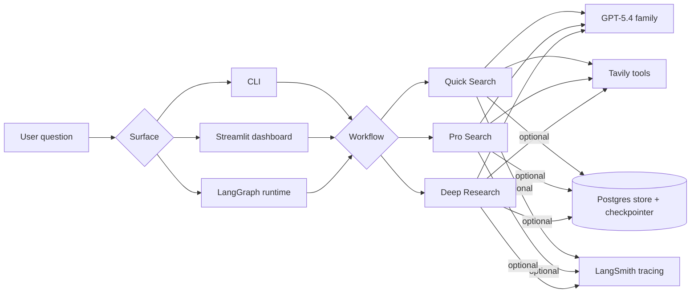
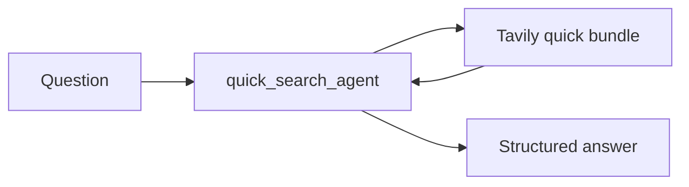
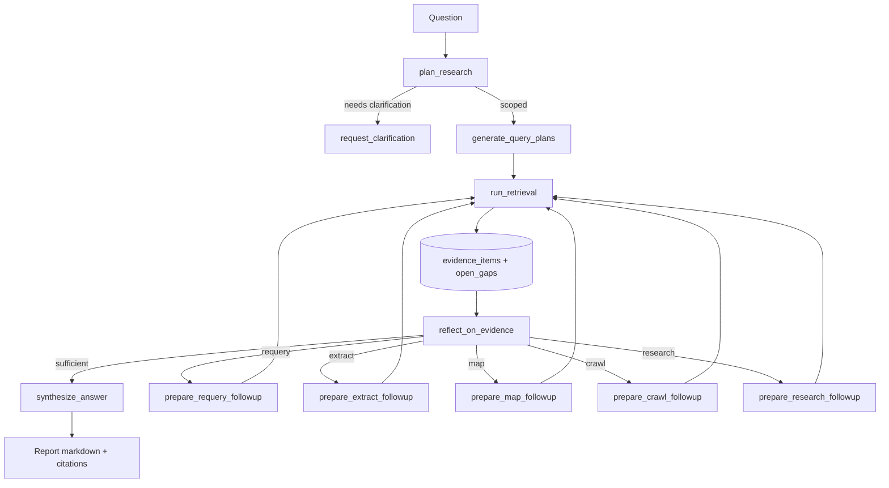

# perplexity-at-home

[](https://github.com/pr1m8/perplexity-at-home/actions/workflows/ci.yml)
[](https://github.com/pr1m8/perplexity-at-home/actions/workflows/docs.yml)
[](https://github.com/pr1m8/perplexity-at-home/actions/workflows/e2e.yml)
[](https://perplexity-at-home.readthedocs.io/)
[](https://pypi.org/project/perplexity-at-home/)
[](https://pypi.org/project/perplexity-at-home/)
[](LICENSE)

`perplexity-at-home` is a packaged research runtime built with LangGraph, Tavily,
OpenAI, and optional Postgres persistence. It ships three distinct research
lanes, defaults to `openai:gpt-5.4`, exposes a packaged Streamlit dashboard,
and keeps runtime configuration centralized in Pydantic Settings.

The point of the package is simple: quick answers, broader synthesis, and real
deep research should not be the same graph.

## Research Lanes

| Workflow        | Shape                                      | Best for                     | Output                                      |
| --------------- | ------------------------------------------ | ---------------------------- | ------------------------------------------- |
| `quick-search`  | single answering agent with Tavily tools   | fast factual questions       | concise markdown answer with citations      |
| `pro-search`    | explicit planning and aggregation graph    | broader web-backed synthesis | structured markdown answer                  |
| `deep-research` | multi-agent LangGraph with reflection loop | report-style investigation   | long-form brief with evidence and citations |

## System Map



## Workflow Graphs

### Quick Search



`quick-search` stays intentionally thin. It is the fastest lane and favors a
clean answer path over orchestration depth.

### Pro Search


`pro-search` is the middle lane: plan a small query set, execute Tavily calls,
normalize evidence, then synthesize a grounded answer.

### Deep Research



`deep-research` is the real DAG-heavy lane. It scopes the job, decomposes it,
routes retrieval strategy, critiques coverage, and loops until the evidence is
good enough or the iteration budget is exhausted.

## How To Run

Install the package dependencies:

```bash
pdm install -G test -G docs
cp .env.example .env
```

Minimal environment:

- `OPENAI_API_KEY`
- `TAVILY_API_KEY`
- `PERPLEXITY_AT_HOME_DEFAULT_MODEL` if you want to override `openai:gpt-5.4`

Run each lane:

```bash
pdm run perplexity-at-home quick-search "What is Tavily?"
pdm run perplexity-at-home pro-search "What changed recently in Tavily's LangChain integration?"
pdm run perplexity-at-home deep-research "Compare Tavily, Exa, and Perplexity for agent retrieval."
```

Turn on durable state:

```bash
make infra-up
make infra-setup
pdm run perplexity-at-home deep-research --persistent "What is Tavily?"
```

Launch the dashboard:

```bash
pdm install -G dashboard
pdm run perplexity-at-home dashboard
```

The dashboard is built around workflow visibility: research output, sources,
workflow graph, and run-state inspection. It is state-first today, not a
token-stream demo surface pretending to be an agent runtime.

## Settings, Persistence, and Runtime Surfaces

- `src/perplexity_at_home/settings.py` owns OpenAI, Tavily, LangSmith, model, and nested Postgres settings.
- `src/perplexity_at_home/core/` owns the async LangGraph store, checkpointer, and persistence wrapper.
- `langgraph.json` exposes `quick_search`, `pro_search`, and `deep_research`, plus the custom store and checkpointer entrypoints.
- Workflow-specific model overrides are supported with settings such as `PERPLEXITY_AT_HOME_QUICK_SEARCH_MODEL` and `PERPLEXITY_AT_HOME_DEEP_RESEARCH_RETRIEVAL_MODEL`.

## Verified Paths

Live runs were re-verified locally on **April 23, 2026** against real OpenAI,
Tavily, and Postgres:

- `quick-search` completed in memory.
- `pro-search` completed in memory.
- `deep-research` completed in memory.
- `deep-research --persistent --setup-persistence` completed against Postgres.

The repository now also includes a gated live E2E suite plus a GitHub Actions
workflow for it:

```bash
make test-e2e
```

The live suite is opt-in through `PERPLEXITY_AT_HOME_RUN_E2E=true` so normal CI
stays fast and deterministic.

## Repository Layout

```text
src/perplexity_at_home/
  agents/
    quick_search/
    pro_search/
    deep_research/
  core/                 # persistence + serializer helpers
  dashboard/            # packaged Streamlit app
  tools/                # Tavily factories and normalization
  settings.py           # Pydantic settings + model selection
  cli.py                # package CLI
docs/                   # MkDocs + Read the Docs
examples/               # runnable demos
infra/                  # local Docker Compose
tests/                  # unit, integration, and gated live E2E tests
```

## Docs, Release, and Quality Gates

- Docs build with MkDocs Material and publish through Read the Docs.
- GitHub Actions cover CI, docs, live E2E, and tagged releases.
- `pdm build` produces the wheel and source distribution for PyPI.
- `make lint`, `make test`, `make docs-build`, and `make release-check` are the main local gates.

Full package docs live at <https://perplexity-at-home.readthedocs.io/>.
