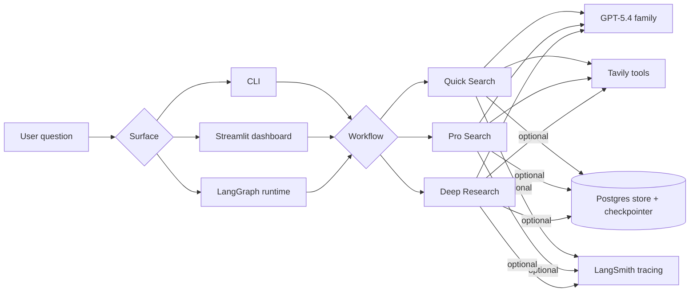
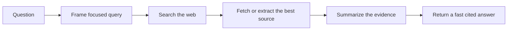
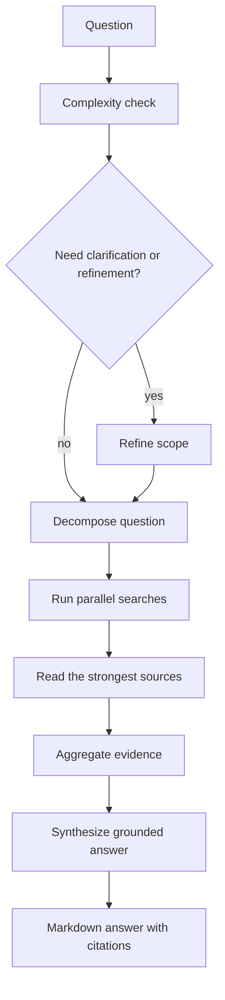
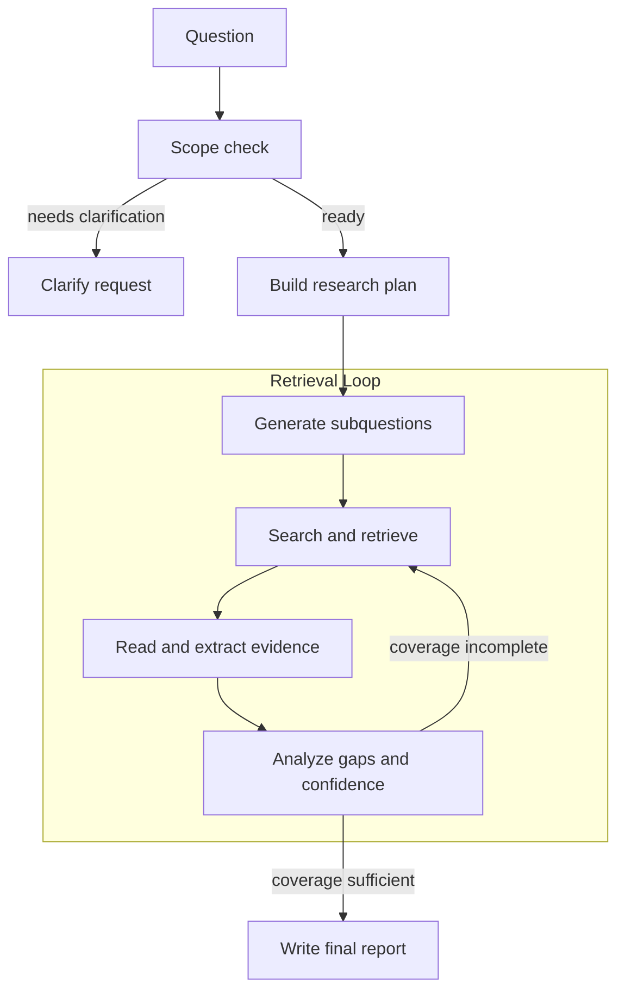

# perplexity-at-home

[](https://github.com/pr1m8/perplexity-at-home/actions/workflows/ci.yml)
[](https://github.com/pr1m8/perplexity-at-home/actions/workflows/docs.yml)
[](https://github.com/pr1m8/perplexity-at-home/actions/workflows/e2e.yml)
[](https://perplexity-at-home.readthedocs.io/)
[](https://pypi.org/project/perplexity-at-home/)
[](https://pypi.org/project/perplexity-at-home/)
[](LICENSE)

`perplexity-at-home` is an open-source, Perplexity-style research runtime built
with LangGraph, Tavily, OpenAI, and optional Postgres persistence. It ships
three distinct research modes, defaults to `openai:gpt-5.4`, exposes a packaged
Streamlit dashboard, and keeps runtime configuration centralized in Pydantic
Settings.

The point of the package is simple: quick answers, broader synthesis, and real
deep research should not be the same graph.

Think of the package as a ladder:
`quick-search -> pro-search -> deep-research`.
Each lane adds more planning, source coverage, and synthesis depth.

## Why This Exists

- `quick-search` for fast cited answers
- `pro-search` for broader multi-source synthesis
- `deep-research` for iterative report-style investigation
- one package surface for CLI, dashboard, and LangGraph runtime entrypoints
- optional Postgres-backed persistence for long-running threads and reloadable state

## One-Minute Tour

```bash
make setup
make quick QUESTION="What changed in LangGraph recently?"
make pro QUESTION="Compare Tavily and Exa for agent retrieval."
make deep QUESTION="Research the tradeoffs between Tavily, Exa, and Perplexity."
make dashboard
```

## Research Lanes

| Workflow        | Shape                                                           | Best for                     | Output                                      |
| --------------- | --------------------------------------------------------------- | ---------------------------- | ------------------------------------------- |
| `quick-search`  | `query -> search -> fetch -> summarize -> answer`               | fast factual questions       | concise markdown answer with citations      |
| `pro-search`    | `clarify -> decompose -> parallel search -> read -> synthesize` | broader web-backed synthesis | structured markdown answer                  |
| `deep-research` | `scope -> plan -> retrieve/read/analyze -> loop -> report`      | report-style investigation   | long-form brief with evidence and citations |

## Example Questions

- `quick-search`: `What changed in LangGraph recently?`
- `pro-search`: `Compare Tavily and Exa for agent retrieval.`
- `deep-research`: `Research best practices for packaging a multi-workflow research agent.`

Runnable demos also live under [`examples/`](examples/), including
[`examples/quick_search_demo.py`](examples/quick_search_demo.py),
[`examples/pro_search_answer_demo.py`](examples/pro_search_answer_demo.py), and
[`examples/deep_research_demo.py`](examples/deep_research_demo.py).

## System Map



## Workflow Graphs

The diagrams below are the public workflow shapes used by the package docs and
dashboard. They intentionally show the product-level flow, not every internal
node name.

### Quick Search



`quick-search` stays intentionally thin. The implementation is still a compact
single-agent surface, but the mental model is shallow retrieval:
`query -> search -> fetch -> summarize -> answer`.

### Pro Search



`pro-search` is the middle lane. In code today it is a tight deterministic
graph around planning, batched Tavily execution, aggregation, and synthesis.
At the package level, the intended flow is:
`query -> complexity/refinement -> decomposition -> parallel search -> read -> aggregate -> synthesize`.

### Deep Research



`deep-research` is the real DAG-heavy lane. The concrete graph routes follow-up
work through retrieval strategies such as `requery`, `extract`, `map`,
`crawl`, and `research`, but the public shape is the iterative research loop
from the design notes: scope, plan, search, read, analyze, repeat, then write.

## How To Run

Install the package dependencies:

```bash
make setup
```

See the local command surface at any time with:

```bash
make help
```

Minimal environment:

- `OPENAI_API_KEY`
- `TAVILY_API_KEY`
- `PERPLEXITY_AT_HOME_DEFAULT_MODEL` if you want to override `openai:gpt-5.4`

Run each lane:

```bash
make quick QUESTION="What is Tavily?"
make pro QUESTION="What changed recently in Tavily's LangChain integration?"
make deep QUESTION="Compare Tavily, Exa, and Perplexity for agent retrieval."
```

Turn on durable state:

```bash
make up
make db-setup
make deep-persistent QUESTION="What is Tavily?"
```

Launch the dashboard:

```bash
make dashboard
```

You can also use the packaged CLI directly:

```bash
pdm run perplexity-at-home quick-search "What is Tavily?"
pdm run perplexity-at-home pro-search "Compare Tavily and Exa for agent retrieval."
pdm run perplexity-at-home deep-research "Research the current LangGraph persistence story."
```

The dashboard is built around workflow visibility: research output, sources,
workflow graph, and run-state inspection. It is state-first today, not a
token-stream demo surface pretending to be an agent runtime.

## Dashboard Flow

Use this when you want the shortest local path:

```bash
make setup
make dashboard
```

If you want persistent runs in the dashboard:

```bash
make up
make db-setup
make dashboard
```

Inside the dashboard:

- pick `quick-search` first if you just want to smoke-test the app
- leave persistence off unless Postgres is already up
- use `pro-search` or `deep-research` once keys are confirmed working
- create a new thread when switching question families
- inspect `Sources`, `Workflow Graph`, and `Run State` after each run

## Settings, Persistence, and Runtime Surfaces

- `src/perplexity_at_home/settings.py` owns OpenAI, Tavily, LangSmith, model, and nested Postgres settings.
- `src/perplexity_at_home/core/` owns the async LangGraph store, checkpointer, and persistence wrapper.
- `langgraph.json` exposes `quick_search`, `pro_search`, and `deep_research`, plus the custom store and checkpointer entrypoints.
- Workflow-specific model overrides are supported with settings such as `PERPLEXITY_AT_HOME_QUICK_SEARCH_MODEL` and `PERPLEXITY_AT_HOME_DEEP_RESEARCH_RETRIEVAL_MODEL`.

## Verified Paths

Live runs were re-verified locally on **April 23, 2026** against real OpenAI,
Tavily, and Postgres:

- `quick-search` completed in memory.
- `pro-search` completed in memory.
- `deep-research` completed in memory.
- `deep-research --persistent --setup-persistence` completed against Postgres.

The repository now also includes a gated live E2E suite plus a GitHub Actions
workflow for it:

```bash
make test-e2e
```

The live suite is opt-in through `PERPLEXITY_AT_HOME_RUN_E2E=true` so normal CI
stays fast and deterministic.

## Repository Layout

```text
src/perplexity_at_home/
  agents/
    quick_search/
    pro_search/
    deep_research/
  core/                 # persistence + serializer helpers
  dashboard/            # packaged Streamlit app
  tools/                # Tavily factories and normalization
  settings.py           # Pydantic settings + model selection
  cli.py                # package CLI
docs/                   # MkDocs + Read the Docs
examples/               # runnable demos
infra/                  # local Docker Compose
tests/                  # unit, integration, and gated live E2E tests
```

## Docs, Release, and Quality Gates

- Docs build with MkDocs Material and publish through Read the Docs.
- GitHub Actions cover CI, docs, live E2E, and release publishing.
- `pdm build` produces the wheel and source distribution for PyPI.
- `make lint`, `make test`, `make docs-build`, and `make release-check` are the main local gates.

## Releasing To PyPI

The canonical release path is a version tag from `main`:

```bash
git tag -a v0.1.0 -m "v0.1.0"
git push origin v0.1.0
```

The `Release` workflow then:

- installs the locked environment
- runs Ruff, pytest, and the docs build
- builds the wheel and sdist
- runs `twine check`
- publishes to PyPI through GitHub trusted publishing
- creates the matching GitHub release

There is also a manual `workflow_dispatch` path for release preflight checks
when you want to validate the release job without pushing a tag.

Full package docs live at <https://perplexity-at-home.readthedocs.io/>.
