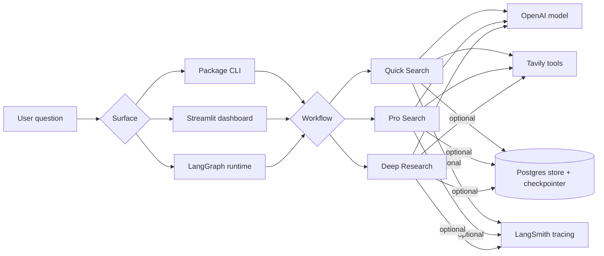
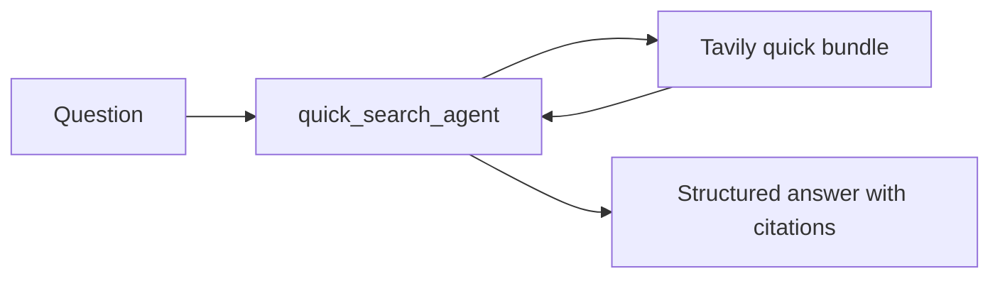
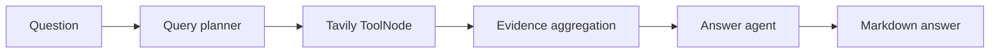
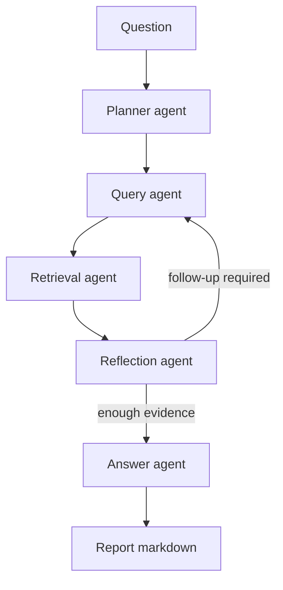

# perplexity-at-home

[](https://github.com/pr1m8/perplexity-at-home/actions/workflows/ci.yml)
[](https://github.com/pr1m8/perplexity-at-home/actions/workflows/docs.yml)
[](https://perplexity-at-home.readthedocs.io/)
[](https://pypi.org/project/perplexity-at-home/)
[](https://pypi.org/project/perplexity-at-home/)
[](LICENSE)

`perplexity-at-home` is a package of Perplexity-style research agents built on
LangGraph, Tavily, OpenAI, and optional Postgres-backed persistence. It ships
three distinct workflows instead of one overloaded agent, uses Pydantic
Settings for runtime configuration, defaults to GPT-5.4, and includes a
packaged Streamlit dashboard.

The repo is designed around a simple idea: fast questions, broader search, and
true deep research should not share the same graph.

## What Ships

| Workflow        | Shape                                             | Output                                 | Core module                                    |
| --------------- | ------------------------------------------------- | -------------------------------------- | ---------------------------------------------- |
| `quick-search`  | single-agent call with Tavily tools               | concise markdown answer with citations | `src/perplexity_at_home/agents/quick_search/`  |
| `pro-search`    | planned search graph with parallel tool execution | synthesized markdown answer            | `src/perplexity_at_home/agents/pro_search/`    |
| `deep-research` | multi-agent graph with reflection loop            | report-style markdown brief            | `src/perplexity_at_home/agents/deep_research/` |

## Hyper Flow



## Agent Graphs

### Quick Search



`quick-search` is the thinnest lane. It favors speed and a clean answer path
over orchestration depth. The runtime lives in
`src/perplexity_at_home/agents/quick_search/runtime.py`.

### Pro Search



`pro-search` is the middle lane: plan a small search set, execute tools in
parallel, normalize evidence, then synthesize. The compiled graph lives in
`src/perplexity_at_home/agents/pro_search/graph.py`.

### Deep Research



`deep-research` is the full research loop. It decomposes the task, retrieves
evidence, critiques coverage, and re-queries when evidence is weak before
writing the final brief. The top-level graph lives in
`src/perplexity_at_home/agents/deep_research/graph.py`.

## Runtime Surfaces

The package exposes the same workflows through three entry points:

| Surface                        | What it does                                                                 | Notes                                          |
| ------------------------------ | ---------------------------------------------------------------------------- | ---------------------------------------------- |
| `perplexity-at-home`           | CLI for `quick-search`, `pro-search`, `deep-research`, and persistence setup | implemented in `src/perplexity_at_home/cli.py` |
| `perplexity-at-home-dashboard` | packaged Streamlit app with workflow switching and thread-aware runs         | optional `dashboard` dependency group          |
| `langgraph.json`               | LangGraph runtime entrypoints for `deep_research` and `pro_search`           | useful for LangGraph dev/server flows          |

## Quickstart

```bash
pdm install -G test -G docs
cp .env.example .env
```

Run each lane from the CLI:

```bash
pdm run perplexity-at-home quick-search "What is Tavily?"
pdm run perplexity-at-home pro-search "What changed recently in Tavily's LangChain integration?"
pdm run perplexity-at-home deep-research "Compare Tavily, Exa, and Perplexity for agent retrieval."
```

Launch the dashboard:

```bash
pdm install -G dashboard
pdm run perplexity-at-home dashboard
```

## Persistence, Models, and Tracing

Local persistence is wired through `src/perplexity_at_home/core/` and can back
all three workflows with a LangGraph store plus checkpointer:

```bash
make infra-up
make infra-setup
pdm run perplexity-at-home deep-research --persistent "What is Tavily?"
```

Important environment settings:

- `OPENAI_API_KEY`
- `TAVILY_API_KEY`
- `PERPLEXITY_AT_HOME_DEFAULT_MODEL` and workflow-specific overrides
- `PERPLEXITY_AT_HOME_POSTGRES__*`
- `LANGSMITH_API_KEY`
- `LANGCHAIN_TRACING_V2=true`

All settings are loaded through `src/perplexity_at_home/settings.py` with
Pydantic Settings and nested Postgres configuration.

## Repository Layout

```text
src/perplexity_at_home/
  agents/
    quick_search/
    pro_search/
    deep_research/
  core/                 # persistence helpers
  dashboard/            # Streamlit launcher + service layer
  tools/                # Tavily tool factories and normalization
  settings.py           # typed app settings
  cli.py                # package CLI
docs/                   # MkDocs + Read the Docs source
examples/               # runnable examples
infra/                  # local Docker Compose
tests/                  # unit and integration tests
```

## Docs, Releases, and Quality Gates

- Docs are built with MkDocs Material and published through Read the Docs.
- GitHub Actions cover CI, docs, and tagged release automation.
- `pdm build` produces the wheel and source distribution for publishing.
- `make lint`, `make test`, and `make docs-build` are the main local quality gates.

Current test coverage is strong for settings, builders, CLI wiring, persistence,
dashboard normalization, and graph behavior. Live OpenAI, Tavily, and Postgres
E2E runs are validated manually today; a full automated external-service E2E
suite is still an active follow-up rather than a finished part of the package.
