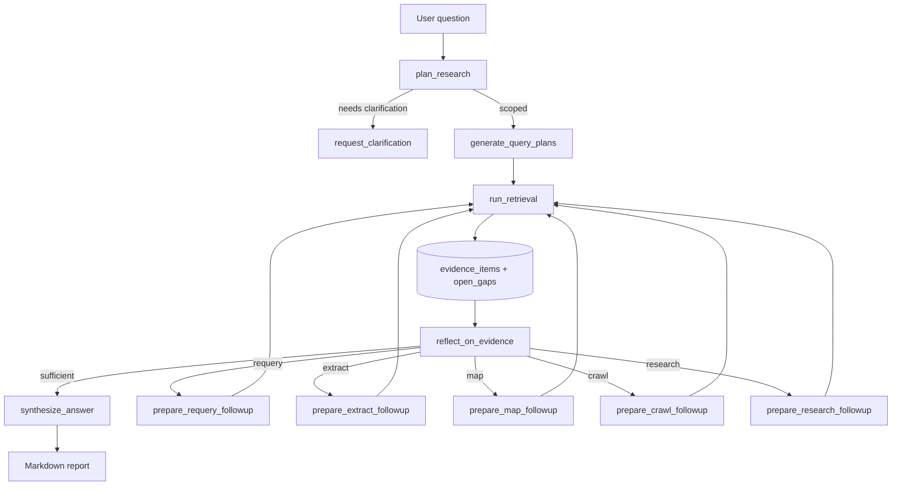
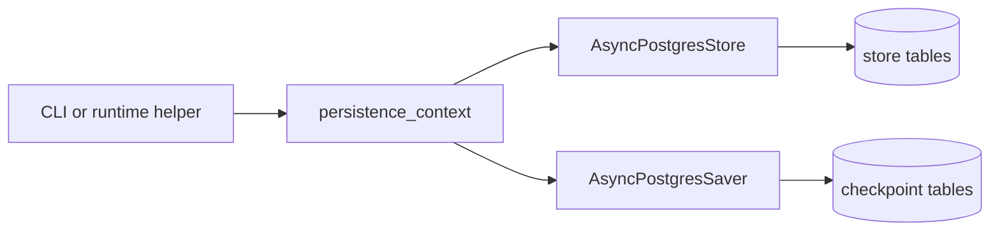

# Architecture

## Deep-research workflow

The top-level graph lives in `src/perplexity_at_home/agents/deep_research/graph.py`.
It composes specialized child agents instead of forcing one agent to plan,
retrieve, critique, route follow-up work, and synthesize in a single step.

## Persistence model

When persistence is enabled, the runtime opens both the LangGraph store and
checkpointer together through `perplexity_at_home.core.persistence`.

The same persistence primitives are also exposed through `langgraph.json` so
the LangGraph runtime can resolve the repository's custom store and
checkpointer entrypoints directly.

## Package layout

- `src/perplexity_at_home/settings.py`: typed app settings and model selection
- `src/perplexity_at_home/core/`: Postgres persistence helpers
- `src/perplexity_at_home/agents/deep_research/`: graph, runtime, and child agents
- `src/perplexity_at_home/agents/pro_search/`: faster research workflow
- `src/perplexity_at_home/agents/quick_search/`: focused answer path for smaller tasks
- `src/perplexity_at_home/dashboard/`: packaged Streamlit dashboard, launcher, and service layer
- `examples/`: runnable demos kept close to the package surface

## Current testing shape

The repository has unit and graph coverage for local deterministic behavior,
plus a gated live E2E layer for OpenAI, Tavily, and Postgres-backed runs. The
live suite is opt-in so normal CI remains deterministic, while the `Live E2E`
workflow can validate the real external path when credentials are configured.
