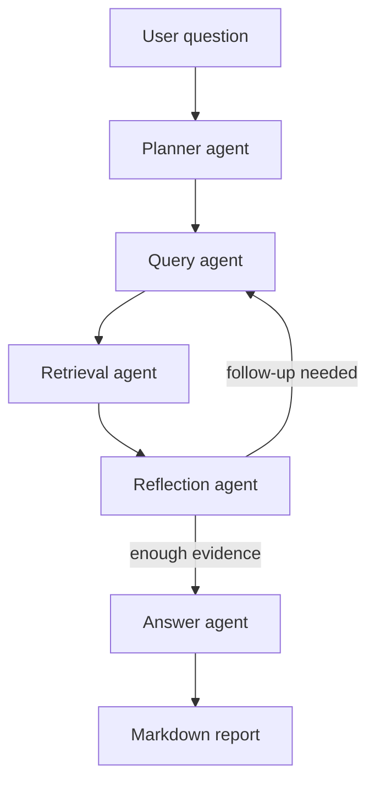
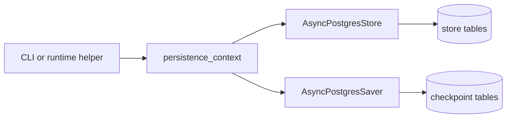

# Architecture

## Deep-research workflow

The top-level graph lives in `src/perplexity_at_home/agents/deep_research/graph.py`.
It composes specialized child agents instead of forcing one agent to plan,
retrieve, critique, and synthesize in a single step.

## Persistence model

When persistence is enabled, the runtime opens both the LangGraph store and
checkpointer together through `perplexity_at_home.core.persistence`.

## Package layout

- `src/perplexity_at_home/settings.py`: typed app settings and model selection
- `src/perplexity_at_home/core/`: Postgres persistence helpers
- `src/perplexity_at_home/agents/deep_research/`: graph, runtime, and child agents
- `src/perplexity_at_home/agents/pro_search/`: faster research workflow
- `src/perplexity_at_home/agents/quick_search/`: focused answer path for smaller tasks
- `src/perplexity_at_home/dashboard/`: packaged Streamlit dashboard, launcher, and service layer
- `examples/`: runnable demos kept close to the package surface

## Current testing shape

The repository has strong unit and integration coverage, but not a full
external-service E2E suite yet. Live runs against OpenAI, Tavily, and Postgres
are currently validated manually or in targeted local checks.
